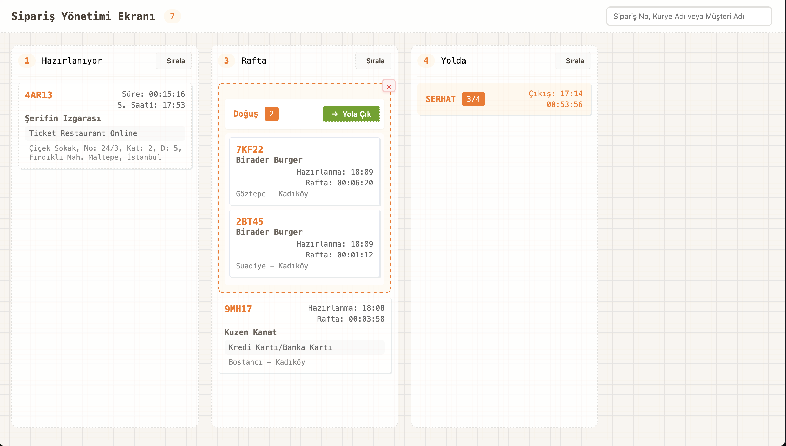

# Paket Mutfak - Sipariş Yönetimi Arayüz Geliştirme

## Arayüz Tasarımı

> Bu mockup arayüzün genel yapısını ve bileşenlerin yerleşimini göstermektedir. 
> Tasarımı birebir kopyalamak zorunda değilsin, bu sadece referans olması için! 
> Daha iyi bir fikrin varsa onu da uygulayabilirsin 🎨

## Proje Hakkında
Hey! Paket Mutfak'ın harika sipariş yönetim arayüzünü geliştirmeye hoş geldin 👋 
Bu projede React ile siparişlerin takibi ve kurye atamaları için kullanılacak modern bir arayüz oluşturacağız.

## Temel Kavramlar

### Sipariş (Order)
- Birden fazla ürün içerebilir
- Teslim adresi ve sipariş saati bilgilerini içerir
- Durumlar: Hazırlanıyor, Hazırlandı, Yolda, Teslim Edildi

### Sepet (Basket)
- Bir veya birden fazla siparişin gruplanmış hali
- Kuryeye atanması gereken siparişleri içerir
- Durumlar: Hazır, Yolda, Tamamlandı

### Kurye (Courier)
- Sepetleri alıp müşterilere siparişleri dağıtan kişi

## Teknik Gereksinimler
- React
- Ant Design ve React Query kullanabilirsin (opsiyonel)
- Json-server ile çalışan bir API kullanacağız

## Arayüz Gereksinimleri

### 1. Hazırlananlar Sütunu
- Hazırlanmakta olan siparişleri gösterir
- Özellikler:
  - Sipariş ID'si
  - Hazırlanma süresi
  - Sipariş saati
  - Restoran adı
  - Ödeme yöntemi
  - Teslimat adresi (tam adres)

### 2. Bekleyen Siparişler Sütunu
- Üst kısımda: Sepetler
- Alt kısımda: Henüz sepete atanmamış hazır siparişler
- Özellikler:
  - Siparişler sepetlere atanabilmeli/çıkarılabilmeli
  - Sepet oluşturma deneyimi tasarlanmalı (drag&drop veya alternatif)
  - Her sepete bir kurye atanabilmeli
  - Kuryesi atanan sepetler "Yoldaki Siparişler" sütununa taşınabilmeli

### 3. Yoldaki Siparişler Sütunu
- Kuryesi atanmış ve yola çıkmış sepetleri gösterir
- Özellikler:
  - Sepet içeriği ve kurye değiştirilemez
  - Her sipariş için "Teslim Edildi" ve "Teslim Edilemedi" seçenekleri olmalı
  - Teslim durumu görsel olarak belirtilmeli
  - Tüm siparişleri teslim edilen sepetler otomatik kaldırılmalı

## Ekstra Özellikler (Opsiyonel)
- Tamamlanmış sepetler için ek sütun
- Sipariş detay modalı

### Mikro Etkileşimler ve Animasyonlar
> Bu özellikler zorunlu değil, ama harika bir kullanıcı deneyimi için bunun gibi özellikler eklemeyi düşünebilirsin 

- Sürükle & Bırak İşlemleri
  - Siparişleri sepete sürükleyebilme
  - Sepetleri sütunlar arası taşıyabilme
  - Sürükleme sırasında görsel geri bildirim
- Sağ Tık Menüleri
  - Siparişler için hızlı işlemler (Sepete Ekle, Detay Görüntüle)
  - Sepetler için kurye atama ve yönetim
- Geçiş Animasyonları
  - Sipariş durumu değişimlerinde yumuşak geçişler
  - Sepet oluşturma/silme animasyonları
  - Hover ve aktif durum efektleri
- Bildirimler ve Geri Bildirimler
  - İşlem başarılı/başarısız bildirimleri
  - Yeni sipariş geldiğinde görsel/işitsel uyarı
  - Kurye atama onayları
- Alternatif kullanıcı deneyimi önerileri

## Önemli Notlar
> Zamanının değerli olduğunun farkındayız! Bu görevin tamamını yapmak zorunda değilsin. 
> Seçtiğin özellikleri iyi bir şekilde implemente etmen, her şeyi yarım yamalak yapmandan çok daha değerli. 
> Yaptığın kısımdan emin ol yeter 😊

- Geliştirme süresi: 1 hafta
- Tüm özellikleri tamamlayamasan da elinden geleni yapman yeterli! 
- Kendi harika fikirlerini de eklemekten çekinme 💡
- Projeyi nasıl çalıştıracağımızı anlatan bir README eklemeyi unutmayın
- Uygulamanın ekran görüntülerini README'ye ekleyebilirsiniz

## Başlangıç
Hadi başlayalım! 🎉
1. Projeyi React ile oluşturun
2. Gerekli bağımlılıkları yükleyin (Ant Design, React Query vb.)
3. Json-server'ı başlatın
4. Geliştirmeye başlayın!
